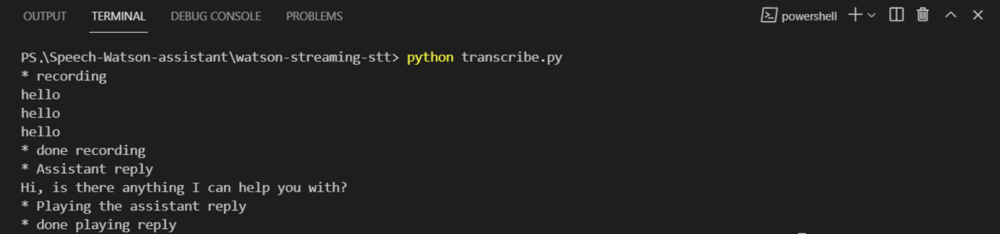

# Speech Watson assistant

<!-- PROJECT IMAGE -->
<p align="center">

</p>

<!-- TABLE OF CONTENTS -->
## Table of Contents

* [Abstract](#abstract)
* [Installation](#installation)
* [Quick Start](#quick-start)
* [Implementation](#implementation)
* [Output](#output)

<!-- ABSTRACT -->
## Abstract

This repository to communicate with [Watson Assistant](https://www.ibm.com/cloud/watson-assistant) by voice. The idea behind this repository is to convert the speech-to-text by [Watson Speech to Text](https://www.ibm.com/cloud/watson-speech-to-text) and then save it in [`output.txt`](https://github.com/MohammedAlosaimi/Speech-Watson-assistant/blob/master/watson-streaming-stt/output.txt). furthermore, it takes the text in [`output.txt`](https://github.com/MohammedAlosaimi/Speech-Watson-assistant/blob/master/watson-streaming-stt/output.txt) and sends it as a request to Watson Assistant. After geting the response, it converts the responce from text to speech by [Watson Text to Speech](https://www.ibm.com/cloud/watson-text-to-speech) and then saves it in [`output.mp3`](https://github.com/MohammedAlosaimi/Speech-Watson-assistant/blob/master/watson-streaming-stt/output.mp3) as an mp3 file.

<!-- INSTALLATION -->
## Installation

To install, use `pip`: 

```bash
pip install -r requirements.txt
```
if errors on windows installing `pyaudio`
Install `pipwin`: 

```bash
pip install pipwin
```

Then go install `pyaudio`: 

```bash
pipwin install pyaudio
```

<!-- QUICK START -->
## Quick Start

All you need to run this program is to Install the requirements and then you can run the program from [`transcribe`](https://github.com/MohammedAlosaimi/Speech-Watson-assistant/blob/master/watson-streaming-stt/transcribe.py). Note: You may need to change the `apikey` and `url` if you want to run it from your own server. Text-to-Speech from [`textospeech.py`](https://github.com/MohammedAlosaimi/Speech-Watson-assistant/blob/master/watson-streaming-stt/textospeech.py) and Speech-to-Text from [`speech.cfg`](https://github.com/MohammedAlosaimi/Speech-Watson-assistant/blob/master/watson-streaming-stt/setup.cfg). To use your Watson assistant, you need to change the `apikey`, `url` and `assistantId`  from [`assistant.py`](https://github.com/MohammedAlosaimi/Speech-Watson-assistant/blob/master/watson-streaming-stt/assistant.py) ]

```python
apikey = "your apikey"
url = "your url"

assistantId = "your assistant id"
```

<!-- IMPLEMENTATION -->
## Implementation

The following code was added in [`transcribe`](https://github.com/MohammedAlosaimi/Speech-Watson-assistant/blob/master/watson-streaming-stt/transcribe.py) to saving the text in a txt file and then called `watsonAssistantChat()` function from [`assistant.py`](https://github.com/MohammedAlosaimi/Speech-Watson-assistant/blob/master/watson-streaming-stt/assistant.py) in order to connect with Watson Assistant and get a response. then it call `storeMP3File()` function to convert the text to speech and save the result in an mp3 file.

```python
def textToSpeech():
    # to save the results in txt file
    with open('output.txt', 'w') as output:
        output.writelines(textResult)
    
    # Get an assistant reply
    assistant.watsonAssistantChat()
```

The following code is in [`assiatant.py`](https://github.com/MohammedAlosaimi/Speech-Watson-assistant/blob/master/watson-streaming-stt/assistant.py). It is used to open a txt file to send a request to Watson Assistan and then call `storeMP3File()` to convert the response to speech by Watson Text to Speech and then save it as an mp3 file. After that, the `system` will play the mp3 file.

```python
def watsonAssistantChat():
    # open the txt file and take the results
    with open('output.txt', 'r') as out:
        text = out.readlines()
    
    # combine the multi lines in one line
    text = [line.replace('\n', '') for line in text]
    text = ''.join(str(line) for line in text)

    # Response msg from the assistant service
    response = assistant.message_stateless(
    assistant_id=assistantId,
    input={
        'message_type': 'text',
        'text': text
    }
    ).get_result()

    # change the response to a json string
    msg = json.dumps(response)

    result = "Sorry, there is a response problem"

    # Loads the msg and the return the result.
    data = json.loads(msg)
    if "output" in data:
        result = data['output']['generic'][0]['text']
  
    # Print the assistant reply
    print("* Assistant reply")
    print(result)
    
    # Convert the text to speech and then store it in mp3 file
    textospeech.storeMP3File(result)

    # Playing the output.mp3 file 
    print("* Playing the assistant reply")
    os.system('output.mp3')
    print("* done playing reply")
```

The following code is in [`textospeech.py`](https://github.com/MohammedAlosaimi/Speech-Watson-assistant/blob/master/watson-streaming-stt/textospeech.py). It is used to convert the text to speech by Watson Text to Speech and then save it as an mp3 file.

```python
def storeMP3File(text):

    # convert the text to speech and then store it in mp3 file
    with open('output.mp3', 'wb') as audio_file:
        res = tts.synthesize(text, accept='audio/mp3', voice='en-US_AllisonV3Voice').get_result()
        audio_file.write(res.content)
```

<!-- OUTPUT -->
## Output

The following figure is a simple result of these codes.

<p align="center">

</p>
